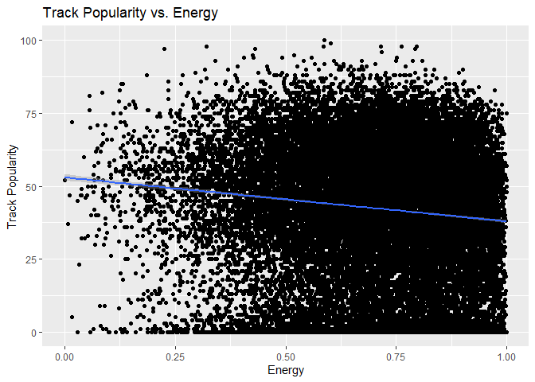
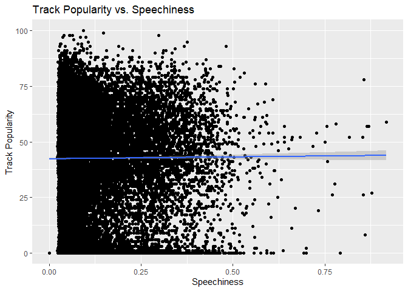
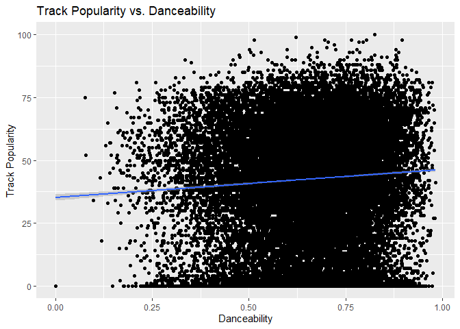
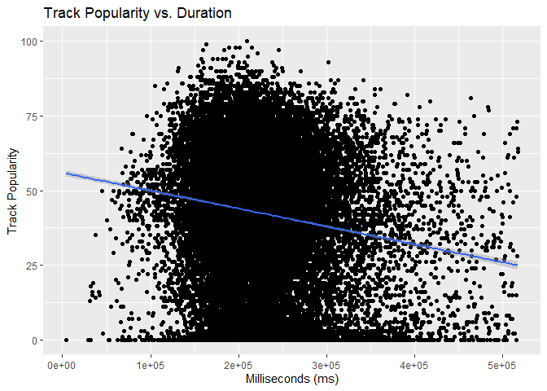

Stat 850 Final Project
================
Neetu Regmi, Cassie Tangen, Oliver Titus

## Introduction

There are a wide range of genres and each genre has its own unique
traits that sets it apart from the other genres. We plan to investigate
what makes rock, R\&B, rap, EDM, latin, and pop different based on their
length, danceability, energy, and loudness. We will then analyze the
popularity of each genre. Based on their popularities we will look to
see which factor plays the most important roll, if any does, in the
popularity of songs.

## Data Description

The data we are analyzing was obtained from TidyTuesday. The data was
obtained by using the spotifyr package created by Charlie Thompson,
Josiah Parry, Donal Phipps, and Tom Wolff. The spotifyr package allows
the bulk pulling of features tracks from Spotify’s Web API. Since we are
novices at using new packages, we decided just using the data collected
by TidyTuesday using spotifyr would be sufficient for our study. We do
recognize the fact that there is a potential bias to the data we are
analyzing because we are not aware of the search parameters used by
TidyTuesday when collecting this data using spotifyr.

In our study we will focus on the danceability, energy, speechiness,
popularity, length, and loudness of songs. We will primarily group data
based on the song’s genre.

> We need to find a properly cite all of the definitions. (use:
> <https://github.com/rfordatascience/tidytuesday/tree/master/data/2020/2020-01-21>)

## Data Summary

We will look at the interesting variables mentioned above for each of
the genre to attempt to determine a defining characteristic or two about
each genre.

Let’s first look at a nice stacked boxplot for each of the variables
that we are interested in exploring along with a boxplot of the
popularity of each genre. These might give us a visual idea of which
variables are key characteristics for each genre.

> Need to include box plots for: duration, danceability, energy,
> loudness, and speechines and popularity. I have duration, loudness and
> popularity need to add energy and danceability.

### Visual Exploration of Data

<!-- -->

<!-- -->

<!-- -->

<!-- -->

<!-- -->

<!-- -->

It appears that rock and R\&B have the longest durations and EDM is the
shortest. EDM appears to be the loudest with R\&B the least loud. Let’s
look at the means numerically as well. It appears that pop and latin on
average are more popular and EDM is the least popular.

> We will want to make some comments about each of these boxplots before
> moving on to some nice summary statistics.

### Summary Statistics

Let’s look closer by looking numerically at our data. I’m also curious
about how many songs there are for each genre so I am going to find the
number of songs in each genre now as well. The number of tracks could
have an impact on the popularity of the genre. Below we have a table
that nicely shows summary statistics for our data.

> For our summary statistics we should organize everything in one tibble
> together then I believe Oliver said he can make it look pretty? If we
> could put everything that Oliver has down below for danceability,
> energy, and speechiness into the same tibble as I (Cassie) have going
> here that would work towards the cohesiveness of the project.

> Here is a good option for a summary table with all of the means Oliver
> could you make this look pretty?

    # A tibble: 6 x 8
      playlist_genre count mean_loudness mean_duration_i~ mean_danceabili~
      <chr>          <int>         <dbl>            <dbl>            <dbl>
    1 edm             6043         -5.43          222541.            0.655
    2 latin           5155         -6.26          216863.            0.713
    3 pop             5507         -6.32          217768.            0.639
    4 r&b             5431         -7.86          237599.            0.670
    5 rap             5746         -7.04          214164.            0.718
    6 rock            4951         -7.59          248577.            0.521
    # ... with 3 more variables: mean_speechiness <dbl>, mean_energry <dbl>,
    #   mean_mean_popularity <dbl>

## Results

``` 
                  Df Sum Sq Mean Sq F value Pr(>F)    
playlist_genre     5   68.2   13.64    1666 <2e-16 ***
Residuals      32827  268.8    0.01                   
---
Signif. codes:  0 '***' 0.001 '**' 0.01 '*' 0.05 '.' 0.1 ' ' 1
```

``` 
                  Df Sum Sq Mean Sq F value Pr(>F)    
playlist_genre     5    148   29.53    1046 <2e-16 ***
Residuals      32827    927    0.03                   
---
Signif. codes:  0 '***' 0.001 '**' 0.01 '*' 0.05 '.' 0.1 ' ' 1
```

``` 
                  Df Sum Sq Mean Sq F value Pr(>F)    
playlist_genre     5    133   26.54    1560 <2e-16 ***
Residuals      32827    558    0.02                   
---
Signif. codes:  0 '***' 0.001 '**' 0.01 '*' 0.05 '.' 0.1 ' ' 1
```

``` 
                  Df Sum Sq Mean Sq F value Pr(>F)    
playlist_genre     5  23521    4704     573 <2e-16 ***
Residuals      32827 269694       8                   
---
Signif. codes:  0 '***' 0.001 '**' 0.01 '*' 0.05 '.' 0.1 ' ' 1
```

``` 
                  Df   Sum Sq  Mean Sq F value Pr(>F)    
playlist_genre     5 4.93e+12 9.87e+11     288 <2e-16 ***
Residuals      32827 1.13e+14 3.43e+09                   
---
Signif. codes:  0 '***' 0.001 '**' 0.01 '*' 0.05 '.' 0.1 ' ' 1
```

``` 
                  Df   Sum Sq Mean Sq F value Pr(>F)    
playlist_genre     5   627013  125403     207 <2e-16 ***
Residuals      32827 19866852     605                   
---
Signif. codes:  0 '***' 0.001 '**' 0.01 '*' 0.05 '.' 0.1 ' ' 1
```

> Since the Anova tests above all result in rejecting the null
> hypothesis that all of the groups have equal means we should perform a
> tukey test to see which is different.

``` 
  Tukey multiple comparisons of means
    95% family-wise confidence level

Fit: aov(formula = speechiness ~ playlist_genre, data = spotify_songs)

$playlist_genre
              diff      lwr     upr p adj
latin-edm   0.0160  0.01107  0.0208     0
pop-edm    -0.0127 -0.01751 -0.0079     0
r&b-edm     0.0301  0.02528  0.0349     0
rap-edm     0.1108  0.10606  0.1156     0
rock-edm   -0.0290 -0.03394 -0.0241     0
pop-latin  -0.0287 -0.03366 -0.0237     0
r&b-latin   0.0141  0.00912  0.0192     0
rap-latin   0.0949  0.08991  0.0998     0
rock-latin -0.0450 -0.05009 -0.0398     0
r&b-pop     0.0428  0.03787  0.0477     0
rap-pop     0.1235  0.11865  0.1284     0
rock-pop   -0.0163 -0.02135 -0.0112     0
rap-r&b     0.0807  0.07583  0.0856     0
rock-r&b   -0.0591 -0.06416 -0.0540     0
rock-rap   -0.1398 -0.14481 -0.1348     0
```

``` 
  Tukey multiple comparisons of means
    95% family-wise confidence level

Fit: aov(formula = energy ~ playlist_genre, data = spotify_songs)

$playlist_genre
               diff     lwr     upr p adj
latin-edm  -0.09416 -0.1032 -0.0851 0.000
pop-edm    -0.10145 -0.1104 -0.0925 0.000
r&b-edm    -0.21154 -0.2205 -0.2026 0.000
rap-edm    -0.15177 -0.1606 -0.1429 0.000
rock-edm   -0.06966 -0.0788 -0.0605 0.000
pop-latin  -0.00728 -0.0166  0.0020 0.221
r&b-latin  -0.11738 -0.1267 -0.1081 0.000
rap-latin  -0.05760 -0.0668 -0.0484 0.000
rock-latin  0.02450  0.0150  0.0340 0.000
r&b-pop    -0.11009 -0.1193 -0.1009 0.000
rap-pop    -0.05032 -0.0593 -0.0413 0.000
rock-pop    0.03179  0.0224  0.0412 0.000
rap-r&b     0.05977  0.0507  0.0688 0.000
rock-r&b    0.14188  0.1325  0.1513 0.000
rock-rap    0.08210  0.0728  0.0914 0.000
```

``` 
  Tukey multiple comparisons of means
    95% family-wise confidence level

Fit: aov(formula = danceability ~ playlist_genre, data = spotify_songs)

$playlist_genre
               diff      lwr      upr p adj
latin-edm   0.05825  0.05120  0.06529 0.000
pop-edm    -0.01574 -0.02266 -0.00881 0.000
r&b-edm     0.01514  0.00819  0.02209 0.000
rap-edm     0.06331  0.05646  0.07016 0.000
rock-edm   -0.13449 -0.14162 -0.12737 0.000
pop-latin  -0.07399 -0.08119 -0.06678 0.000
r&b-latin  -0.04311 -0.05034 -0.03588 0.000
rap-latin   0.00507 -0.00206  0.01220 0.328
rock-latin -0.19274 -0.20014 -0.18534 0.000
r&b-pop     0.03088  0.02377  0.03799 0.000
rap-pop     0.07905  0.07204  0.08606 0.000
rock-pop   -0.11875 -0.12603 -0.11147 0.000
rap-r&b     0.04817  0.04114  0.05521 0.000
rock-r&b   -0.14963 -0.15693 -0.14233 0.000
rock-rap   -0.19780 -0.20501 -0.19060 0.000
```

``` 
  Tukey multiple comparisons of means
    95% family-wise confidence level

Fit: aov(formula = loudness ~ playlist_genre, data = spotify_songs)

$playlist_genre
              diff    lwr    upr p adj
latin-edm  -0.8370 -0.992 -0.682 0.000
pop-edm    -0.8879 -1.040 -0.736 0.000
r&b-edm    -2.4374 -2.590 -2.285 0.000
rap-edm    -1.6148 -1.765 -1.464 0.000
rock-edm   -2.1614 -2.318 -2.005 0.000
pop-latin  -0.0509 -0.209  0.107 0.943
r&b-latin  -1.6004 -1.759 -1.442 0.000
rap-latin  -0.7778 -0.935 -0.621 0.000
rock-latin -1.3244 -1.487 -1.162 0.000
r&b-pop    -1.5495 -1.706 -1.393 0.000
rap-pop    -0.7269 -0.881 -0.573 0.000
rock-pop   -1.2736 -1.434 -1.114 0.000
rap-r&b     0.8226  0.668  0.977 0.000
rock-r&b    0.2760  0.115  0.436 0.000
rock-rap   -0.5466 -0.705 -0.388 0.000
```

``` 
  Tukey multiple comparisons of means
    95% family-wise confidence level

Fit: aov(formula = duration_ms ~ playlist_genre, data = spotify_songs)

$playlist_genre
             diff    lwr    upr p adj
latin-edm   -5677  -8842  -2513 0.000
pop-edm     -4773  -7882  -1663 0.000
r&b-edm     15059  11938  18179 0.000
rap-edm     -8377 -11452  -5302 0.000
rock-edm    26036  22836  29235 0.000
pop-latin     905  -2330   4139 0.968
r&b-latin   20736  17491  23982 0.000
rap-latin   -2700  -5901    502 0.155
rock-latin  31713  28392  35034 0.000
r&b-pop     19831  16640  23023 0.000
rap-pop     -3604  -6752   -457 0.014
rock-pop    30808  27540  34077 0.000
rap-r&b    -23436 -26594 -20277 0.000
rock-r&b    10977   7697  14257 0.000
rock-rap    34413  31176  37649 0.000
```

``` 
  Tukey multiple comparisons of means
    95% family-wise confidence level

Fit: aov(formula = track_popularity ~ playlist_genre, data = spotify_songs)

$playlist_genre
             diff    lwr    upr p adj
latin-edm  12.193 10.864 13.522 0.000
pop-edm    12.911 11.605 14.217 0.000
r&b-edm     6.390  5.079  7.701 0.000
rap-edm     8.382  7.090  9.674 0.000
rock-edm    6.895  5.551  8.239 0.000
pop-latin   0.718 -0.640  2.077 0.660
r&b-latin  -5.803 -7.166 -4.440 0.000
rap-latin  -3.811 -5.156 -2.466 0.000
rock-latin -5.298 -6.693 -3.903 0.000
r&b-pop    -6.521 -7.862 -5.181 0.000
rap-pop    -4.529 -5.851 -3.207 0.000
rock-pop   -6.017 -7.390 -4.644 0.000
rap-r&b     1.992  0.665  3.319 0.000
rock-r&b    0.505 -0.873  1.882 0.903
rock-rap   -1.487 -2.847 -0.128 0.022
```

> We will want to talk about the results of both the ANOVA and the Tukey
> tests.

> This section has the relationships between popularity and the
> characteristics that we were interested in looking at. We should have
> both scatterplots and some sort of hypothesis test.

## Explore the relationship between popularity and each of the following: danceability, energy, speechiness, length, and loudness.

## Danceability

    `geom_smooth()` using formula 'y ~ x'

<!-- -->

``` 

Call:
lm(formula = track_popularity ~ danceability, data = spotify_songs)

Residuals:
   Min     1Q Median     3Q    Max 
-46.02 -18.42   2.93  19.48  57.10 

Coefficients:
             Estimate Std. Error t value Pr(>|t|)    
(Intercept)    35.176      0.636    55.3   <2e-16 ***
danceability   11.150      0.948    11.8   <2e-16 ***
---
Signif. codes:  0 '***' 0.001 '**' 0.01 '*' 0.05 '.' 0.1 ' ' 1

Residual standard error: 24.9 on 32831 degrees of freedom
Multiple R-squared:  0.00419,   Adjusted R-squared:  0.00416 
F-statistic:  138 on 1 and 32831 DF,  p-value: <2e-16
```

From the scatterplot, there appears to be no significant relationship
between danceability and track popularity.Since our r squared value is
close to zero,the variation observed in track popularity is not
explained by danceability.

## Energy

    `geom_smooth()` using formula 'y ~ x'

<!-- -->

``` 

Call:
lm(formula = track_popularity ~ energy, data = spotify_songs)

Residuals:
   Min     1Q Median     3Q    Max 
-52.57 -18.39   2.78  19.50  56.99 

Coefficients:
            Estimate Std. Error t value Pr(>|t|)    
(Intercept)   53.004      0.547    96.9   <2e-16 ***
energy       -15.069      0.758   -19.9   <2e-16 ***
---
Signif. codes:  0 '***' 0.001 '**' 0.01 '*' 0.05 '.' 0.1 ' ' 1

Residual standard error: 24.8 on 32831 degrees of freedom
Multiple R-squared:  0.0119,    Adjusted R-squared:  0.0119 
F-statistic:  396 on 1 and 32831 DF,  p-value: <2e-16
```

From the scatterplot, there appears to be slightly negative relationship
between track popularity and energy but variation in track popularity is
not explained by energy as we see r squared value is close to zero.

\#\#speechiness

    `geom_smooth()` using formula 'y ~ x'

<!-- -->

``` 

Call:
lm(formula = track_popularity ~ speechiness, data = spotify_songs)

Residuals:
   Min     1Q Median     3Q    Max 
-43.63 -18.40   2.64  19.60  57.55 

Coefficients:
            Estimate Std. Error t value Pr(>|t|)    
(Intercept)   42.297      0.201  210.84   <2e-16 ***
speechiness    1.682      1.361    1.24     0.22    
---
Signif. codes:  0 '***' 0.001 '**' 0.01 '*' 0.05 '.' 0.1 ' ' 1

Residual standard error: 25 on 32831 degrees of freedom
Multiple R-squared:  4.65e-05,  Adjusted R-squared:  1.6e-05 
F-statistic: 1.53 on 1 and 32831 DF,  p-value: 0.217
```

From the scatterplot, it appears that there is no significant
relationship between track popularity and speechiness. As we can see any
variation in track popularity cannot be explained by speechiness since r
squared is almost close to 0.

## Length(duration)

    `geom_smooth()` using formula 'y ~ x'

<!-- -->

``` 

Call:
lm(formula = track_popularity ~ duration_ms, data = spotify_songs)

Residuals:
   Min     1Q Median     3Q    Max 
-55.78 -18.34   2.52  19.47  56.54 

Coefficients:
             Estimate Std. Error t value Pr(>|t|)    
(Intercept)  5.60e+01   5.33e-01   105.2   <2e-16 ***
duration_ms -6.00e-05   2.28e-06   -26.3   <2e-16 ***
---
Signif. codes:  0 '***' 0.001 '**' 0.01 '*' 0.05 '.' 0.1 ' ' 1

Residual standard error: 24.7 on 32831 degrees of freedom
Multiple R-squared:  0.0206,    Adjusted R-squared:  0.0206 
F-statistic:  692 on 1 and 32831 DF,  p-value: <2e-16
```

This scatterplot shows that there is a negative relationship between
duration of song and track popularity but since r squared value is close
to zero

## Loudness

    `geom_smooth()` using formula 'y ~ x'

<!-- -->

``` 

Call:
lm(formula = track_popularity ~ loudness, data = spotify_songs)

Residuals:
   Min     1Q Median     3Q    Max 
-46.27 -18.42   3.01  19.57  58.25 

Coefficients:
            Estimate Std. Error t value Pr(>|t|)    
(Intercept)  45.7178     0.3388   135.0   <2e-16 ***
loudness      0.4823     0.0461    10.5   <2e-16 ***
---
Signif. codes:  0 '***' 0.001 '**' 0.01 '*' 0.05 '.' 0.1 ' ' 1

Residual standard error: 24.9 on 32831 degrees of freedom
Multiple R-squared:  0.00333,   Adjusted R-squared:  0.0033 
F-statistic:  110 on 1 and 32831 DF,  p-value: <2e-16
```

There appears to be no significant relationship between track popularity
and loudness since our r squared value is closer to zero, most of
variation is not explained by the loudness which suggests that there
might other variables at play.

## Group Members

Neetu Regmi Oliver Titus Cassie Tangen

## References:

TidyTuesday:
<https://github.com/rfordatascience/tidytuesday/tree/master/data/2020/2020-01-21>

Spotifyr: <https://www.rcharlie.com/spotifyr/>

## Code from our rough draft that we may not need for our final paper.

1.Explore the relationship between playlist subgenre and track
popularity .

    Warning: package 'ggthemes' was built under R version 4.0.3

<!-- --> Some extra
info on the values of track popularity:The score is received from the
Spotify API. The value will be between 0 and 100, with 100 being the
most popular.The popularity is calculated by algorithm and is based, in
the most part, on the total number of plays the track has had and how
recent those plays are. From the above chart, It seems that most of the
playlist subgenere popularity lies between 75 and 100. Some of those are
dance pop, post-teen pop, pop edm, latin hip hop, hip hop while the
lowest popularity are around 75 like new jack swing, hard rock. I would
say according to the chart popularity of song among subgenre are not
extremely varied.

2.Explore a potential relationship between mode and song key.

> You’ll need to clean this data. Key should be A, B, C, D, E, F, G +
> flat/sharp. The numbers likely are factor categories, and you probably
> need the label. See the tidytuesday documentation

> Similarly, mode is also likely to be categorical:
> <https://en.wikipedia.org/wiki/Mode_(music)>. From looking at the
> documentation, it appears they’re misusing the term mode to represent
> major (1) or minor(0). If that’s the case, you might have better luck
> looking at the mode as it relates to genre - certain genres are much
> more likely to use minor keys (they have a sad, haunting sound,
> usually), where I’d assume pop and other upbeat stuff would be more
> likely to use a major key.

    Warning in grid.Call(C_stringMetric, as.graphicsAnnot(x$label)): font family not
    found in Windows font database
    
    Warning in grid.Call(C_stringMetric, as.graphicsAnnot(x$label)): font family not
    found in Windows font database
    
    Warning in grid.Call(C_stringMetric, as.graphicsAnnot(x$label)): font family not
    found in Windows font database

    Warning in grid.Call(C_textBounds, as.graphicsAnnot(x$label), x$x, x$y, : font
    family not found in Windows font database
    
    Warning in grid.Call(C_textBounds, as.graphicsAnnot(x$label), x$x, x$y, : font
    family not found in Windows font database
    
    Warning in grid.Call(C_textBounds, as.graphicsAnnot(x$label), x$x, x$y, : font
    family not found in Windows font database
    
    Warning in grid.Call(C_textBounds, as.graphicsAnnot(x$label), x$x, x$y, : font
    family not found in Windows font database
    
    Warning in grid.Call(C_textBounds, as.graphicsAnnot(x$label), x$x, x$y, : font
    family not found in Windows font database
    
    Warning in grid.Call(C_textBounds, as.graphicsAnnot(x$label), x$x, x$y, : font
    family not found in Windows font database
    
    Warning in grid.Call(C_textBounds, as.graphicsAnnot(x$label), x$x, x$y, : font
    family not found in Windows font database
    
    Warning in grid.Call(C_textBounds, as.graphicsAnnot(x$label), x$x, x$y, : font
    family not found in Windows font database
    
    Warning in grid.Call(C_textBounds, as.graphicsAnnot(x$label), x$x, x$y, : font
    family not found in Windows font database
    
    Warning in grid.Call(C_textBounds, as.graphicsAnnot(x$label), x$x, x$y, : font
    family not found in Windows font database
    
    Warning in grid.Call(C_textBounds, as.graphicsAnnot(x$label), x$x, x$y, : font
    family not found in Windows font database
    
    Warning in grid.Call(C_textBounds, as.graphicsAnnot(x$label), x$x, x$y, : font
    family not found in Windows font database

    Warning in grid.Call.graphics(C_text, as.graphicsAnnot(x$label), x$x, x$y, :
    font family not found in Windows font database

    Warning in grid.Call(C_textBounds, as.graphicsAnnot(x$label), x$x, x$y, : font
    family not found in Windows font database
    
    Warning in grid.Call(C_textBounds, as.graphicsAnnot(x$label), x$x, x$y, : font
    family not found in Windows font database

<!-- --> This chart
shows the relationship that for mode 0 and 1, the key varies. By looking
at the vertical line, we could say that variability within mode 0 and 1
looks similar because they both vary on different value of key.

> You’re plotting this as a numeric variable when neither variable is
> actually numeric. Please revise and treat this as a categorical
> variable\!

\#\#Relationship between dancebaility and energy

    Warning: Computation failed in `stat_binhex()`:
      Package `hexbin` required for `stat_binhex`.
      Please install and try again.

<!-- --> This
scatterplot shows the relationship between danceability and energy also
we can see that highest number of observation falls around when both
danceability and energy are above 0.50.This suggests that we can expect
that high value of danceability will likely have high value of energy
ignoring some outliers. Also, I wanted to circle the region that has
large number of points cluster together, tried few things to get some
sort of outline to focus on that region didn’t work, was unsuccessful.

3.  Explore the relationship between danceability and tempo.

<!-- end list -->

    `geom_smooth()` using formula 'y ~ x'

<!-- -->

``` 

Call:
lm(formula = danceability ~ tempo, data = spotify_songs)

Residuals:
    Min      1Q  Median      3Q     Max 
-0.7749 -0.0899  0.0152  0.1030  0.3332 

Coefficients:
             Estimate Std. Error t value Pr(>|t|)    
(Intercept)  7.75e-01   3.62e-03   213.9   <2e-16 ***
tempo       -9.93e-04   2.93e-05   -33.9   <2e-16 ***
---
Signif. codes:  0 '***' 0.001 '**' 0.01 '*' 0.05 '.' 0.1 ' ' 1

Residual standard error: 0.143 on 32831 degrees of freedom
Multiple R-squared:  0.0339,    Adjusted R-squared:  0.0339 
F-statistic: 1.15e+03 on 1 and 32831 DF,  p-value: <2e-16
```

According to this regression output, there appears to be a significant
negative relationship between danceability and tempo because of the
negative and significant coeffiecient on loudness. But, the R^2 is quite
small, so most of the variability in danceability is not explained by
tempo. This is also apparent in the scatter plot.

2.  Explore the relationship between danceability and loudness.

<!-- end list -->

    `geom_smooth()` using formula 'y ~ x'

<!-- -->

``` 

Call:
lm(formula = danceability ~ loudness, data = spotify_songs)

Residuals:
    Min      1Q  Median      3Q     Max 
-0.6310 -0.0924  0.0164  0.1055  0.3304 

Coefficients:
            Estimate Std. Error t value Pr(>|t|)    
(Intercept) 0.663114   0.001970  336.64  < 2e-16 ***
loudness    0.001230   0.000268    4.59  4.4e-06 ***
---
Signif. codes:  0 '***' 0.001 '**' 0.01 '*' 0.05 '.' 0.1 ' ' 1

Residual standard error: 0.145 on 32831 degrees of freedom
Multiple R-squared:  0.000642,  Adjusted R-squared:  0.000611 
F-statistic: 21.1 on 1 and 32831 DF,  p-value: 4.41e-06
```

Looking at the scatter plot, there appears to be no significant
relationship between loudness and danceability because of the
coefficient on loudness and the R^2 being almost 0.

## Summary statistics for danceability for each genre:

### EDM

``` 
   Min. 1st Qu.  Median    Mean 3rd Qu.    Max. 
  0.162   0.576   0.659   0.655   0.741   0.983 
```

### Latin

``` 
   Min. 1st Qu.  Median    Mean 3rd Qu.    Max. 
  0.077   0.655   0.729   0.713   0.792   0.979 
```

### Pop

``` 
   Min. 1st Qu.  Median    Mean 3rd Qu.    Max. 
  0.098   0.563   0.652   0.639   0.729   0.979 
```

### R\&B

``` 
   Min. 1st Qu.  Median    Mean 3rd Qu.    Max. 
  0.140   0.584   0.689   0.670   0.771   0.977 
```

### Rap

``` 
   Min. 1st Qu.  Median    Mean 3rd Qu.    Max. 
  0.150   0.634   0.737   0.718   0.820   0.975 
```

### Rock

``` 
   Min. 1st Qu.  Median    Mean 3rd Qu.    Max. 
  0.000   0.429   0.523   0.521   0.615   0.956 
```

We see that rap has the highest mean danceability and rock has the
lowest mean danceabiltiy according the summary statistics and the box
plot.

## Summary statistics for energy for each genre:

### EDM

``` 
   Min. 1st Qu.  Median    Mean 3rd Qu.    Max. 
  0.106   0.723   0.830   0.802   0.913   0.998 
```

### Latin

``` 
   Min. 1st Qu.  Median    Mean 3rd Qu.    Max. 
  0.000   0.620   0.729   0.708   0.821   1.000 
```

### Pop

``` 
   Min. 1st Qu.  Median    Mean 3rd Qu.    Max. 
  0.008   0.594   0.727   0.701   0.830   0.999 
```

### R\&B

``` 
   Min. 1st Qu.  Median    Mean 3rd Qu.    Max. 
  0.012   0.469   0.596   0.591   0.721   0.995 
```

### Rap

``` 
   Min. 1st Qu.  Median    Mean 3rd Qu.    Max. 
  0.016   0.546   0.665   0.651   0.776   0.999 
```

### Rock

``` 
   Min. 1st Qu.  Median    Mean 3rd Qu.    Max. 
  0.017   0.606   0.775   0.733   0.896   0.998 
```

EDM appears has the highest mean energy according to the summary
statistics and box plot, and R\&B has the lowest mean energy.

## Summary statistics for speechiness for each genre:

### EDM

``` 
   Min. 1st Qu.  Median    Mean 3rd Qu.    Max. 
  0.024   0.044   0.060   0.087   0.098   0.624 
```

### Latin

``` 
   Min. 1st Qu.  Median    Mean 3rd Qu.    Max. 
  0.023   0.044   0.067   0.103   0.127   0.662 
```

### Pop

``` 
   Min. 1st Qu.  Median    Mean 3rd Qu.    Max. 
  0.023   0.037   0.049   0.074   0.079   0.869 
```

### R\&B

``` 
   Min. 1st Qu.  Median    Mean 3rd Qu.    Max. 
  0.022   0.042   0.068   0.117   0.158   0.918 
```

### Rap

``` 
   Min. 1st Qu.  Median    Mean 3rd Qu.    Max. 
  0.024   0.079   0.178   0.198   0.290   0.877 
```

### Rock

``` 
   Min. 1st Qu.  Median    Mean 3rd Qu.    Max. 
  0.000   0.033   0.042   0.058   0.063   0.488 
```

Every genre seems to have a very similar amount of speechiness, although
rap seems to have significantly higher mean speechiness than the other
genres.

> Some of this would be a lot easier if you use group\_by\! Right now
> you’re doing it by hand\!

> This tibble that I made here should be made pretty. I think Oliver
> said he could do that? - C

It appears that the genre with the longest songs is rock and the genre
with the shortest songs is rap. Would be interesting to perform a
hypothesis test to see if there is a statitical difference between the
lengths of songs.

Let’s go ahead and calculate mean popularity and add it to the genre
table

It appears that EDM is the least popular on average, but it has the most
songs so that could be impacting the popularity. I would be interested
in performing a hypothesis test to see if EDM’s mean popularity is
statistically different than that of the others that all appear to be
roughly the same popularity-wise.

It seems R\&B is the least loud and EDM is the loudest. There is not a
huge spread between genre’s for loudness, but it does seem that EDM is a
decent amount louder than the other varieties. I would be interesting in
running a hypothesis test here as well.
