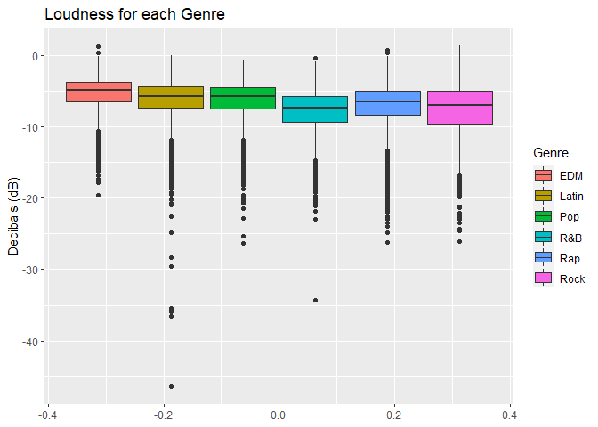
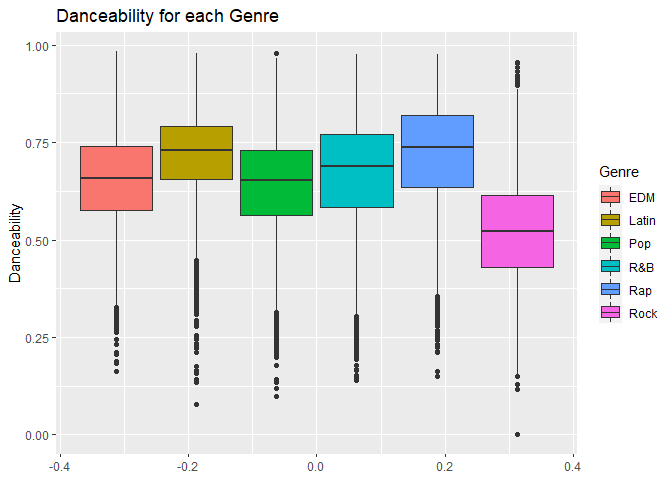
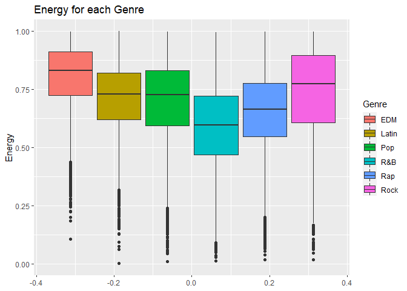
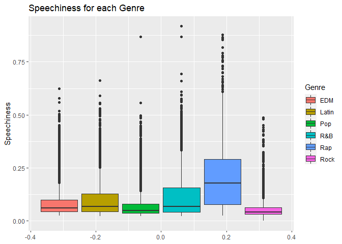
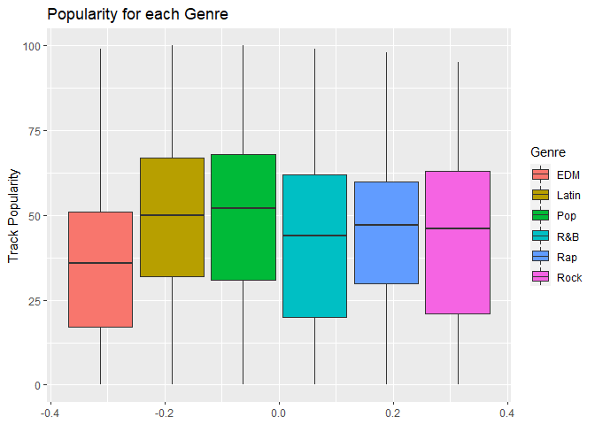

STAT 850 Final Project
================
Neetu Regmi, Cassie Tangen, Oliver Titus

## Introduction

Music plays a role in everyone’s life regardless of age, race, gender,
social class or any other defining characteristic. With the expansion of
the world wide web numerous online music streaming platforms have become
a popular source of listening to music. One such platform is Spotify.
Spotify first launched in 2008 and has grown to offer more than 60
million songs. Spotify contains songs from a variety of genres and keeps
track of the popularity of each track along with various other
characteristics of each track. As a group we were interested in studying
these characteristics to determine if there are unique characteristics
that make each genre unique, or if some of the characteristics are
shared across the genres. (Spotify, 2020)

We were able to find a nice set of data from TidyTuesday. The data was
shared in the Jan 21, 2020 TidyTuesday folder. The data was originally
obtained by making use of the spotifyr package.(Mock, 2020) The spotifyr
package was created by Charlie Thompson, Josiah Parry, Donal Phipps, and
Tom Wolff. The spotifyr package allows the bulk pulling of features
tracks from Spotify’s Web API. Since we are novices at using new
packages, we decided just using the data collected by TidyTuesday using
spotifyr would be sufficient for our study. We do recognize the fact
that there is a potential bias to the data we are analyzing because we
are not aware of the search parameters used by TidyTuesday when
collecting this data using spotifyr.(R Wrapper for the ‘Spotify’ Web
API, n.d.)

## Data Description

The genres that data was collected on include rock, R\&B, rap, EDM,
Latin, and pop. Each of these genre’s likely illicit thoughts about
certain characteristics. For example, rock and EDM I then to think of
loud, whereas R\&B I tend to think is softer. Rap is often thought to be
almost spoken whereas Latin is much more musical with the vocals. Latin
or pop are often thought as a genre for dancing and rock is not a genre
many people dance to. Thinking about how each of these genres are so
vastly different we are going to look at 5 characteristics that we feel
would be different across the genres.

The characteristics that we determined would be best to study were the
duration, loudness, speechiness, energy, and danceability. We will look
at each of these along with popularity, first to determine if there is a
unique characteristic for each genre and then if there is a relationship
between each of these characteristics and their overall popularity. We
also look at the popularity of each genre to help us determine if a
particular characteristic about the music tends to make the song more
popular.

We should begin with an explanation of our variables. Duration is the
measure of the length of the song and is reported in milliseconds.
Danceability is a value between 0.0 and 1.0 where 0.0 is the least
danceable and 1.0 is the most danceable. The danceability is determined
by an algorithm that looks at the beat strength, tempo, rhythm
stability, and overall regularity. Energy is a value between 0.0 and 1.0
that represents the intensity and activity. Energetic tracks are often
fast and noisy. The loudness is measured in decibels (dB) and is the
average of the decibels across the entire track. Values will typically
range between -60 and 0 dB. Speechiness is the measure of the spoken
word present in a song. The closer the value is to 1 the more
speech-like the track. Songs above 0.66 are likely entirely spoken
words. (Mock, 2020)

## Data Summary

We will look at the interesting variables mentioned above for each of
the genre to attempt to determine a defining characteristic or two about
each genre. Let’s first look at a nice stacked boxplot for each of the
variables that we are interested in exploring along with a boxplot of
the popularity of each genre. These might give us a visual idea of which
variables are key characteristics for each genre.

### Visual Exploration of Data

<!-- -->

As we inspect the boxplot of duration for each genre we see that the
duration of the tracks we see that Rock and R\&B have the longest
tracks. EDM seems to have the shortest duration. It is important though
to note that the differences between the genres is pretty small so there
is likely very little difference statistically.

<!-- -->

When inspecting the average loudness of tracks for each genre we
discover a bit more variation than we saw with the duration. We note
here that EDM appears to be the loudest with R\&B the least loud. It is
interesting here to see that Latin has what appears to be a few outliers
that are much quieter than the rest of the Latin tracks.

<!-- -->

After a quick look at the boxplot for the danceability of each genre it
is clear that rock is the least danceable. Latin is fairly danceable and
surprisingly so is rap.

<!-- -->

The boxplot for each of each genre doesn’t show us anything too
surprising. It would be expected that EDM would be high energy and R\&B
would be low energy. Also not surprising rock appears to be a bit higher
in energy than all but EDM.

<!-- -->

When it comes to thinking about speechiness one would of course guess
that rap would be the speechiest. The boxplot clearly depicts and
significant difference in the speechiness between the genres with rap
having a much higher speechiness rating than the other genres.

<!-- -->

As we conclude our graphical comparisons we wanted to take a look at the
popularity of tracks based on genre. It is pretty clear from the boxplot
that EDM is the least popular with pop being the most popular genre. Now
that we have taken a look at the these boxplots we can would guess that
there would be a statistical difference in the average danceability,
energy, and speechiness based on genres. While we expect that the
duration and loudness of each genre would statistically be roughly the
same even though we can pick out a few that appear to be on the upper or
lower end of the spectrum it is not a huge difference.

### Summary Statistics

Before we test to see if there is a statistical difference or not with
each of these characteristics we would like to take a look at the means.
The boxplots summarize the data by using the five number summary which
showcases the minimum, first quartile, median, third quartile, and
maximum of our data. These values are more likely to be skewed by
outliers as compared to the mean. Below we have a couple tables that
display the mean of each genre for the characteristics we are studying.

## Results

Interestingly even though we guessed that there may not be a statistical
difference with the duration and the loudness of tracks between the
genres we found in all of the overall F-tests shown above that we should
reject the null hypothesis that the mean speechiness, energy,
danceability, loudness, duration, and popularity are the same. This
means that there is a difference with all of these characteristics
across each genre. We will investigate these differences using a Tukey
test to determine which genres are different that the others.

When we conduct the Tukey test we can see that there is a significant
difference in the speechiness of each genre. This was not a very
surprising result though as we figured that at least rap was
significantly different that each of the other genres.

When comparing the genres to each other for energy using the Tukey test
we found that there is a significant difference between each of the
genres expect for pop and latin. It was found that statistically there
is not a difference between the amount of energy in the tracks that are
of the genres pop and latin.

The Tukey test when looking at danceability found that rap and latin
have a similar danceability level while all of the other genres are
statistically different.

When looking at the loudness of genres using the tukey test we see that
pop and latin are extremely similar, but the other genres are all
different for the level of loudness.

When analyzing the duration of track across the genres we found from the
Tukey test that pop, latin, and rap have similar durations to each
other, but the other genres are all different.

When looking at popularity rock and R\&B have very similar popularity
rankings as do pop and latin. Rock and rap are also similar, but it is
not as strong of a similarity.

### Explore the relationship between popularity and each of the following: danceability, energy, speechiness, length, and loudness.

### Danceability

<!-- -->

From the scatterplot, there appears to be no significant relationship
between danceability and track popularity.Since our r squared value is
close to zero,the variation observed in track popularity is not
explained by danceability.

### Energy

<!-- -->

From the scatterplot, there appears to be slightly negative relationship
between track popularity and energy but variation in track popularity is
not explained by energy as we see r squared value is close to zero.

### Speechiness

<!-- -->

From the scatterplot, it appears that there is no significant
relationship between track popularity and speechiness. As we can see any
variation in track popularity cannot be explained by speechiness since r
squared is almost close to 0.

### Length (duration)

<!-- -->

This scatterplot shows that there is a negative relationship between
duration of song and track popularity but since r squared value is close
to zero

### Loudness

<!-- -->

There appears to be no significant relationship between track popularity
and loudness since our r squared value is closer to zero, most of
variation is not explained by the loudness which suggests that there
might other variables at play.

## Conclusions

From our study we feel that we can say that there is no clear
relationship between the 5 characteristics that we studied and the
popularity of the track. It was interesting though to note the unique
characteristics that made each genre have it’s own appeal. Ultimately it
is not terribly surprising that there is no one characteristic that will
make a song more popular. With the wide range of people who listen to
music there should be a wide range of traits that are desirable and will
result in a popular song.

If we had time to further our study we would like to… \>need to write a
nice conclusion.

## Group Members

Neetu Regmi Oliver Titus Cassie Tangen

## References:

(n.d.). Retrieved from R Wrapper for the ‘Spotify’ Web API:
<https://www.rcharlie.com/spotifyr/> Mock, T. (2020, January 21).
Retrieved from TidyTuesday:
<https://github.com/rfordatascience/tidytuesday/tree/master/data/2020/2020-01-21>)
Spotify. (2020, November 10). Retrieved from Wikipedia:
<https://en.wikipedia.org/wiki/Spotify>

## Appendix: Summary Statistics and Results Tables

### Summary Statistics

| playlist\_genre | count | mean\_loudness | mean\_duration\_in\_ms | mean\_danceability |
| :-------------- | ----: | -------------: | ---------------------: | -----------------: |
| edm             |  6043 |         \-5.43 |                 222541 |              0.655 |
| latin           |  5155 |         \-6.26 |                 216863 |              0.713 |
| pop             |  5507 |         \-6.32 |                 217768 |              0.639 |
| r\&b            |  5431 |         \-7.87 |                 237599 |              0.670 |
| rap             |  5746 |         \-7.04 |                 214164 |              0.718 |
| rock            |  4951 |         \-7.59 |                 248577 |              0.521 |

| playlist\_genre | count | mean\_speechiness | mean\_energry | mean\_mean\_popularity |
| :-------------- | ----: | ----------------: | ------------: | ---------------------: |
| edm             |  6043 |             0.087 |         0.802 |                   34.8 |
| latin           |  5155 |             0.103 |         0.708 |                   47.0 |
| pop             |  5507 |             0.074 |         0.701 |                   47.7 |
| r\&b            |  5431 |             0.117 |         0.591 |                   41.2 |
| rap             |  5746 |             0.198 |         0.651 |                   43.2 |
| rock            |  4951 |             0.058 |         0.733 |                   41.7 |

### ANOVA for Speechiness

| term            |    df | sumsq | meansq | statistic | p.value |
| :-------------- | ----: | ----: | -----: | --------: | ------: |
| playlist\_genre |     5 |  68.2 | 13.642 |      1666 |       0 |
| Residuals       | 32827 | 268.8 |  0.008 |        NA |      NA |

### ANOVA for Energy

| term            |    df | sumsq | meansq | statistic | p.value |
| :-------------- | ----: | ----: | -----: | --------: | ------: |
| playlist\_genre |     5 |   148 | 29.531 |      1046 |       0 |
| Residuals       | 32827 |   927 |  0.028 |        NA |      NA |

### ANOVA for Danceability

| term            |    df | sumsq | meansq | statistic | p.value |
| :-------------- | ----: | ----: | -----: | --------: | ------: |
| playlist\_genre |     5 |   133 | 26.537 |      1560 |       0 |
| Residuals       | 32827 |   558 |  0.017 |        NA |      NA |

### ANOVA for Loudness

| term            |    df |  sumsq |  meansq | statistic | p.value |
| :-------------- | ----: | -----: | ------: | --------: | ------: |
| playlist\_genre |     5 |  23521 | 4704.11 |       573 |       0 |
| Residuals       | 32827 | 269694 |    8.22 |        NA |      NA |

### ANOVA for Duration

| term            |    df |    sumsq |   meansq | statistic | p.value |
| :-------------- | ----: | -------: | -------: | --------: | ------: |
| playlist\_genre |     5 | 4.93e+12 | 9.87e+11 |       288 |       0 |
| Residuals       | 32827 | 1.13e+14 | 3.43e+09 |        NA |      NA |

### ANOVA for Popularity

| term            |    df |    sumsq | meansq | statistic | p.value |
| :-------------- | ----: | -------: | -----: | --------: | ------: |
| playlist\_genre |     5 |   627013 | 125403 |       207 |       0 |
| Residuals       | 32827 | 19866852 |    605 |        NA |      NA |

### Tukey Test for Speechiness

| term            | contrast   | null.value | estimate | conf.low | conf.high | adj.p.value |
| :-------------- | :--------- | ---------: | -------: | -------: | --------: | ----------: |
| playlist\_genre | latin-edm  |          0 |    0.016 |    0.011 |     0.021 |           0 |
| playlist\_genre | pop-edm    |          0 |  \-0.013 |  \-0.018 |   \-0.008 |           0 |
| playlist\_genre | r\&b-edm   |          0 |    0.030 |    0.025 |     0.035 |           0 |
| playlist\_genre | rap-edm    |          0 |    0.111 |    0.106 |     0.116 |           0 |
| playlist\_genre | rock-edm   |          0 |  \-0.029 |  \-0.034 |   \-0.024 |           0 |
| playlist\_genre | pop-latin  |          0 |  \-0.029 |  \-0.034 |   \-0.024 |           0 |
| playlist\_genre | r\&b-latin |          0 |    0.014 |    0.009 |     0.019 |           0 |
| playlist\_genre | rap-latin  |          0 |    0.095 |    0.090 |     0.100 |           0 |
| playlist\_genre | rock-latin |          0 |  \-0.045 |  \-0.050 |   \-0.040 |           0 |
| playlist\_genre | r\&b-pop   |          0 |    0.043 |    0.038 |     0.048 |           0 |
| playlist\_genre | rap-pop    |          0 |    0.124 |    0.119 |     0.128 |           0 |
| playlist\_genre | rock-pop   |          0 |  \-0.016 |  \-0.021 |   \-0.011 |           0 |
| playlist\_genre | rap-r\&b   |          0 |    0.081 |    0.076 |     0.086 |           0 |
| playlist\_genre | rock-r\&b  |          0 |  \-0.059 |  \-0.064 |   \-0.054 |           0 |
| playlist\_genre | rock-rap   |          0 |  \-0.140 |  \-0.145 |   \-0.135 |           0 |

### Tukey Test for Danceability

| term            | contrast   | null.value | estimate | conf.low | conf.high | adj.p.value |
| :-------------- | :--------- | ---------: | -------: | -------: | --------: | ----------: |
| playlist\_genre | latin-edm  |          0 |    0.058 |    0.051 |     0.065 |       0.000 |
| playlist\_genre | pop-edm    |          0 |  \-0.016 |  \-0.023 |   \-0.009 |       0.000 |
| playlist\_genre | r\&b-edm   |          0 |    0.015 |    0.008 |     0.022 |       0.000 |
| playlist\_genre | rap-edm    |          0 |    0.063 |    0.056 |     0.070 |       0.000 |
| playlist\_genre | rock-edm   |          0 |  \-0.134 |  \-0.142 |   \-0.127 |       0.000 |
| playlist\_genre | pop-latin  |          0 |  \-0.074 |  \-0.081 |   \-0.067 |       0.000 |
| playlist\_genre | r\&b-latin |          0 |  \-0.043 |  \-0.050 |   \-0.036 |       0.000 |
| playlist\_genre | rap-latin  |          0 |    0.005 |  \-0.002 |     0.012 |       0.328 |
| playlist\_genre | rock-latin |          0 |  \-0.193 |  \-0.200 |   \-0.185 |       0.000 |
| playlist\_genre | r\&b-pop   |          0 |    0.031 |    0.024 |     0.038 |       0.000 |
| playlist\_genre | rap-pop    |          0 |    0.079 |    0.072 |     0.086 |       0.000 |
| playlist\_genre | rock-pop   |          0 |  \-0.119 |  \-0.126 |   \-0.111 |       0.000 |
| playlist\_genre | rap-r\&b   |          0 |    0.048 |    0.041 |     0.055 |       0.000 |
| playlist\_genre | rock-r\&b  |          0 |  \-0.150 |  \-0.157 |   \-0.142 |       0.000 |
| playlist\_genre | rock-rap   |          0 |  \-0.198 |  \-0.205 |   \-0.191 |       0.000 |

### Tukey Test for Energy

| term            | contrast   | null.value | estimate | conf.low | conf.high | adj.p.value |
| :-------------- | :--------- | ---------: | -------: | -------: | --------: | ----------: |
| playlist\_genre | latin-edm  |          0 |  \-0.094 |  \-0.103 |   \-0.085 |       0.000 |
| playlist\_genre | pop-edm    |          0 |  \-0.101 |  \-0.110 |   \-0.093 |       0.000 |
| playlist\_genre | r\&b-edm   |          0 |  \-0.212 |  \-0.220 |   \-0.203 |       0.000 |
| playlist\_genre | rap-edm    |          0 |  \-0.152 |  \-0.161 |   \-0.143 |       0.000 |
| playlist\_genre | rock-edm   |          0 |  \-0.070 |  \-0.079 |   \-0.060 |       0.000 |
| playlist\_genre | pop-latin  |          0 |  \-0.007 |  \-0.017 |     0.002 |       0.221 |
| playlist\_genre | r\&b-latin |          0 |  \-0.117 |  \-0.127 |   \-0.108 |       0.000 |
| playlist\_genre | rap-latin  |          0 |  \-0.058 |  \-0.067 |   \-0.048 |       0.000 |
| playlist\_genre | rock-latin |          0 |    0.025 |    0.015 |     0.034 |       0.000 |
| playlist\_genre | r\&b-pop   |          0 |  \-0.110 |  \-0.119 |   \-0.101 |       0.000 |
| playlist\_genre | rap-pop    |          0 |  \-0.050 |  \-0.059 |   \-0.041 |       0.000 |
| playlist\_genre | rock-pop   |          0 |    0.032 |    0.022 |     0.041 |       0.000 |
| playlist\_genre | rap-r\&b   |          0 |    0.060 |    0.051 |     0.069 |       0.000 |
| playlist\_genre | rock-r\&b  |          0 |    0.142 |    0.132 |     0.151 |       0.000 |
| playlist\_genre | rock-rap   |          0 |    0.082 |    0.073 |     0.091 |       0.000 |

### Tukey Test for Loudness

| term            | contrast   | null.value | estimate | conf.low | conf.high | adj.p.value |
| :-------------- | :--------- | ---------: | -------: | -------: | --------: | ----------: |
| playlist\_genre | latin-edm  |          0 |  \-0.837 |  \-0.992 |   \-0.682 |       0.000 |
| playlist\_genre | pop-edm    |          0 |  \-0.888 |  \-1.040 |   \-0.736 |       0.000 |
| playlist\_genre | r\&b-edm   |          0 |  \-2.437 |  \-2.590 |   \-2.285 |       0.000 |
| playlist\_genre | rap-edm    |          0 |  \-1.615 |  \-1.765 |   \-1.464 |       0.000 |
| playlist\_genre | rock-edm   |          0 |  \-2.161 |  \-2.318 |   \-2.005 |       0.000 |
| playlist\_genre | pop-latin  |          0 |  \-0.051 |  \-0.209 |     0.107 |       0.943 |
| playlist\_genre | r\&b-latin |          0 |  \-1.600 |  \-1.759 |   \-1.442 |       0.000 |
| playlist\_genre | rap-latin  |          0 |  \-0.778 |  \-0.935 |   \-0.621 |       0.000 |
| playlist\_genre | rock-latin |          0 |  \-1.324 |  \-1.487 |   \-1.162 |       0.000 |
| playlist\_genre | r\&b-pop   |          0 |  \-1.550 |  \-1.706 |   \-1.393 |       0.000 |
| playlist\_genre | rap-pop    |          0 |  \-0.727 |  \-0.881 |   \-0.573 |       0.000 |
| playlist\_genre | rock-pop   |          0 |  \-1.274 |  \-1.434 |   \-1.114 |       0.000 |
| playlist\_genre | rap-r\&b   |          0 |    0.823 |    0.668 |     0.977 |       0.000 |
| playlist\_genre | rock-r\&b  |          0 |    0.276 |    0.115 |     0.436 |       0.000 |
| playlist\_genre | rock-rap   |          0 |  \-0.547 |  \-0.705 |   \-0.388 |       0.000 |

### Tukey Test for Duration

| term            | contrast   | null.value | estimate | conf.low | conf.high | adj.p.value |
| :-------------- | :--------- | ---------: | -------: | -------: | --------: | ----------: |
| playlist\_genre | latin-edm  |          0 |   \-5677 |   \-8842 |    \-2513 |       0.000 |
| playlist\_genre | pop-edm    |          0 |   \-4773 |   \-7882 |    \-1663 |       0.000 |
| playlist\_genre | r\&b-edm   |          0 |    15059 |    11938 |     18179 |       0.000 |
| playlist\_genre | rap-edm    |          0 |   \-8377 |  \-11452 |    \-5302 |       0.000 |
| playlist\_genre | rock-edm   |          0 |    26036 |    22836 |     29235 |       0.000 |
| playlist\_genre | pop-latin  |          0 |      905 |   \-2330 |      4139 |       0.968 |
| playlist\_genre | r\&b-latin |          0 |    20736 |    17491 |     23982 |       0.000 |
| playlist\_genre | rap-latin  |          0 |   \-2700 |   \-5901 |       502 |       0.155 |
| playlist\_genre | rock-latin |          0 |    31713 |    28392 |     35034 |       0.000 |
| playlist\_genre | r\&b-pop   |          0 |    19831 |    16640 |     23023 |       0.000 |
| playlist\_genre | rap-pop    |          0 |   \-3604 |   \-6752 |     \-457 |       0.014 |
| playlist\_genre | rock-pop   |          0 |    30808 |    27540 |     34077 |       0.000 |
| playlist\_genre | rap-r\&b   |          0 |  \-23436 |  \-26594 |   \-20277 |       0.000 |
| playlist\_genre | rock-r\&b  |          0 |    10977 |     7697 |     14257 |       0.000 |
| playlist\_genre | rock-rap   |          0 |    34413 |    31176 |     37649 |       0.000 |

### Tukey Test for Popularity

| term            | contrast   | null.value | estimate | conf.low | conf.high | adj.p.value |
| :-------------- | :--------- | ---------: | -------: | -------: | --------: | ----------: |
| playlist\_genre | latin-edm  |          0 |   12.193 |   10.864 |    13.522 |       0.000 |
| playlist\_genre | pop-edm    |          0 |   12.911 |   11.605 |    14.217 |       0.000 |
| playlist\_genre | r\&b-edm   |          0 |    6.390 |    5.079 |     7.701 |       0.000 |
| playlist\_genre | rap-edm    |          0 |    8.382 |    7.090 |     9.674 |       0.000 |
| playlist\_genre | rock-edm   |          0 |    6.895 |    5.551 |     8.239 |       0.000 |
| playlist\_genre | pop-latin  |          0 |    0.718 |  \-0.640 |     2.077 |       0.660 |
| playlist\_genre | r\&b-latin |          0 |  \-5.803 |  \-7.166 |   \-4.440 |       0.000 |
| playlist\_genre | rap-latin  |          0 |  \-3.811 |  \-5.156 |   \-2.466 |       0.000 |
| playlist\_genre | rock-latin |          0 |  \-5.298 |  \-6.693 |   \-3.903 |       0.000 |
| playlist\_genre | r\&b-pop   |          0 |  \-6.521 |  \-7.862 |   \-5.181 |       0.000 |
| playlist\_genre | rap-pop    |          0 |  \-4.529 |  \-5.851 |   \-3.207 |       0.000 |
| playlist\_genre | rock-pop   |          0 |  \-6.017 |  \-7.390 |   \-4.644 |       0.000 |
| playlist\_genre | rap-r\&b   |          0 |    1.992 |    0.665 |     3.319 |       0.000 |
| playlist\_genre | rock-r\&b  |          0 |    0.505 |  \-0.873 |     1.882 |       0.903 |
| playlist\_genre | rock-rap   |          0 |  \-1.487 |  \-2.847 |   \-0.128 |       0.022 |

### Regression Output: Danceability

| term         | estimate | std\_error | statistic | p\_value | lower\_ci | upper\_ci |
| :----------- | -------: | ---------: | --------: | -------: | --------: | --------: |
| intercept    |     35.2 |      0.636 |      55.3 |        0 |     33.93 |      36.4 |
| danceability |     11.2 |      0.948 |      11.8 |        0 |      9.29 |      13.0 |

| r\_squared | adj\_r\_squared | mse | rmse | sigma | statistic | p\_value | df |  nobs |
| ---------: | --------------: | --: | ---: | ----: | --------: | -------: | -: | ----: |
|      0.004 |           0.004 | 622 | 24.9 |  24.9 |       138 |        0 |  1 | 32833 |

### Regression Output: Energy

| term      | estimate | std\_error | statistic | p\_value | lower\_ci | upper\_ci |
| :-------- | -------: | ---------: | --------: | -------: | --------: | --------: |
| intercept |     53.0 |      0.547 |      96.9 |        0 |      51.9 |      54.1 |
| energy    |   \-15.1 |      0.758 |    \-19.9 |        0 |    \-16.6 |    \-13.6 |

| r\_squared | adj\_r\_squared | mse | rmse | sigma | statistic | p\_value | df |  nobs |
| ---------: | --------------: | --: | ---: | ----: | --------: | -------: | -: | ----: |
|      0.012 |           0.012 | 617 | 24.8 |  24.8 |       396 |        0 |  1 | 32833 |

### Regression Output: Speechiness

| term        | estimate | std\_error | statistic | p\_value | lower\_ci | upper\_ci |
| :---------- | -------: | ---------: | --------: | -------: | --------: | --------: |
| intercept   |    42.30 |      0.201 |    210.84 |    0.000 |    41.904 |     42.69 |
| speechiness |     1.68 |      1.361 |      1.24 |    0.217 |   \-0.986 |      4.35 |

| r\_squared | adj\_r\_squared | mse | rmse | sigma | statistic | p\_value | df |  nobs |
| ---------: | --------------: | --: | ---: | ----: | --------: | -------: | -: | ----: |
|          0 |               0 | 624 |   25 |    25 |      1.53 |    0.217 |  1 | 32833 |

### Regression Output: Duration

| term         | estimate | std\_error | statistic | p\_value | lower\_ci | upper\_ci |
| :----------- | -------: | ---------: | --------: | -------: | --------: | --------: |
| intercept    |       56 |      0.533 |     105.2 |        0 |        55 |      57.1 |
| duration\_ms |        0 |      0.000 |    \-26.3 |        0 |         0 |       0.0 |

| r\_squared | adj\_r\_squared | mse | rmse | sigma | statistic | p\_value | df |  nobs |
| ---------: | --------------: | --: | ---: | ----: | --------: | -------: | -: | ----: |
|      0.021 |           0.021 | 611 | 24.7 |  24.7 |       692 |        0 |  1 | 32833 |

### Regression Output: Loudness

| term      | estimate | std\_error | statistic | p\_value | lower\_ci | upper\_ci |
| :-------- | -------: | ---------: | --------: | -------: | --------: | --------: |
| intercept |   45.718 |      0.339 |     135.0 |        0 |    45.054 |    46.382 |
| loudness  |    0.482 |      0.046 |      10.5 |        0 |     0.392 |     0.573 |

| r\_squared | adj\_r\_squared | mse | rmse | sigma | statistic | p\_value | df |  nobs |
| ---------: | --------------: | --: | ---: | ----: | --------: | -------: | -: | ----: |
|      0.003 |           0.003 | 622 | 24.9 |  24.9 |       110 |        0 |  1 | 32833 |
